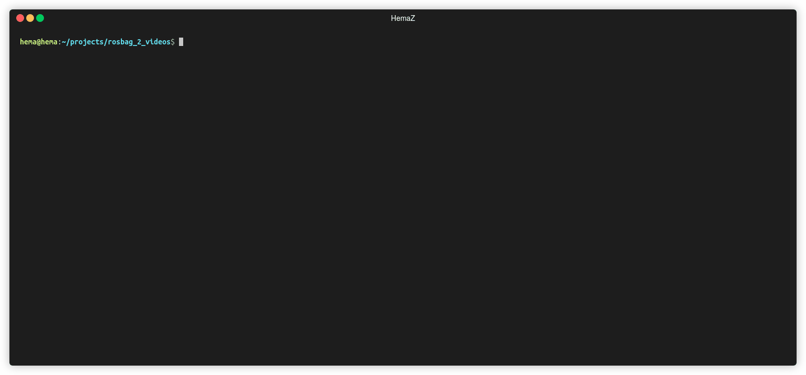

# ROSbag 2 Videos
Extract videos from ROS bags based on `sensor_msgs/Image` topics.

# How to run:

## Python 2:

* Make sure you have a ROS distribution installed or install it from this link [Melodic](http://wiki.ros.org/melodic/Installation/Ubuntu)
* Run the script: `python ros_bag_2_videos.py --bag BAGPATH`

## Python 3:

You need to have some ROS packages installed to be able to use the script. 

You can install it using the following Command

* `$ pip3 install -r requirements.txt`

Now run the script using 

* `python3 ros_bag_2_videos.py --bag BAGPATH`

  
